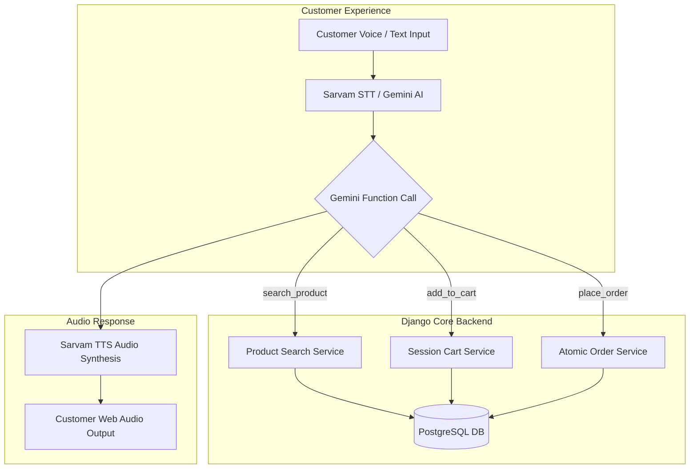

# ZERO-CLICK STORE OPERATOR
> **Autonomous AI Store Operator for Neighborhood Kirana Shops**

Zero-Click Store Operator is an end-to-end, multi-shopkeeper digital ordering platform powered by **Gemini Conversational AI** and **Sarvam AI Multilingual Voice (Hindi / Hinglish / English)**. It allows neighborhood shops to establish a digital presence and enables customers to order groceries using natural voice or text conversations with zero UI friction.

---

## 🚀 Key Features

* **Multi-Shopkeeper Onboarding & Management**: Shopkeepers can register, log in, create their shop, add/edit products, and update inventory and pricing in real time.
* **Shop-Isolated Inventory**: Complete tenant isolation ensuring products and orders belong exclusively to specific shopkeepers.
* **Multilingual AI Ordering (Gemini)**: Natural conversational ordering supporting Hindi, Hinglish, and English with dynamic function calling (product search, stock check, session cart management, and order placement).
* **Sarvam AI Voice Integration**: High-accuracy Indian voice input (**Sarvam Speech-to-Text `saaras:v3`**) and spoken responses (**Sarvam Text-to-Speech `bulbul:v3`**).
* **Session-Based Cart**: Shop-specific customer shopping carts maintained via Django session state.
* **Transaction-Safe Order Execution**: Row-level locking (`select_for_update()`) and atomic transactions (`transaction.atomic()`) guaranteeing stock integrity during concurrent order creation.
* **No Direct AI Database Access**: Gemini AI executes strictly via backend Django functions/tools; PostgreSQL remains the single source of truth.

---

## 🛠 Tech Stack

* **Backend**: Django 6.1 (Python 3.14)
* **Database**: PostgreSQL (`django.db.backends.postgresql` with `psycopg-binary`)
* **Conversational AI**: Google Gemini 2.5 Flash / 2.0 Flash (`google-genai`) with function calling
* **Voice Processing**: Sarvam AI REST API (`saaras:v3` STT & `bulbul:v3` TTS)
* **Frontend**: Django HTML Templates, CSS3, Vanilla JavaScript (MediaRecorder Web Audio API)

---

## 📊 System Architecture & Data Flow



---

## ⚙️ Quick Setup & Installation

### 1. Prerequisites
* Python 3.10+
* PostgreSQL running locally or remotely

### 2. Environment Configuration
Create a `.env` file in the root directory based on `.env.example`:

```env
SECRET_KEY=your-django-secret-key
DEBUG=True

DB_NAME=zero_click_db
DB_USER=postgres
DB_PASSWORD=your_postgres_password
DB_HOST=localhost
DB_PORT=5432

GEMINI_API_KEY=your_gemini_api_key
SARVAM_API_KEY=your_sarvam_api_key
```

### 3. Install Dependencies
```bash
pip install -r requirements.txt
```

### 4. Database Setup & Seeding
```bash
# Run migrations
python manage.py migrate

# Seed demo shopkeeper, shops, and products
python manage.py seed_demo_data --reset
```

### 5. Run Development Server
```bash
python manage.py runserver
```

Open `http://127.0.0.1:8000` in your web browser.

---

## 🧪 Testing

Run the automated Django unit tests covering shop isolation, inventory stock limits, session cart calculations, and atomic order placement:

```bash
python manage.py test
```

---

## 📽 Demo Walkthrough

### 👨‍🌾 Shopkeeper Flow
1. Navigate to `/shopkeeper/login/` (or click **Shopkeeper Login** in header).
2. Demo Login: Username: `rahul`, Password: `Password123!`
3. Access Dashboard (`/shopkeeper/dashboard/`) to manage products, adjust prices, update stock, or view received customer orders.

### 🛒 Customer Ordering Flow
1. Visit the home page (`http://127.0.0.1:8000`).
2. Select a store (e.g. **Rahul General Store**).
3. Type or speak your order in natural language:
   * *English*: "Add 2kg Aashirvaad Atta and 1L Amul Milk to my cart"
   * *Hindi*: "2 kilo aata aur 1 liter amul milk cart mein add kar do"
   * *Hinglish*: "Amul milk ka price kya hai?"
4. Review cart and click **Confirm & Place Order**.
5. Order is instantly created in PostgreSQL and inventory stock is automatically deducted!

---

## 🔐 Security & Data Integrity

* **No Hardcoded API Keys**: All secrets are retrieved dynamically via `python-decouple`.
* **API Key Isolation**: Secrets (`.env`) are excluded from Git tracking via `.gitignore`.
* **Database Guardrails**: Stock levels cannot be negative; total amounts are computed strictly in Python/PostgreSQL using exact `Decimal` arithmetic.
