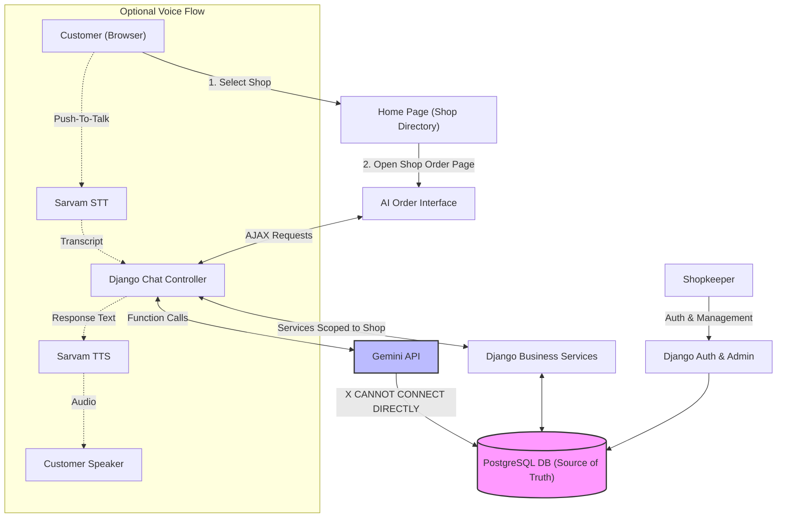
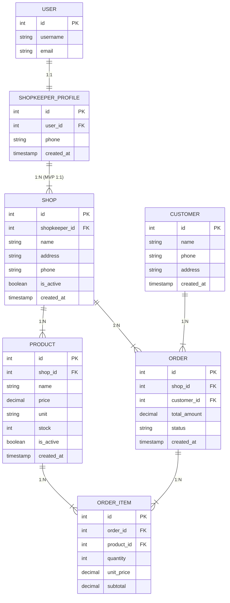
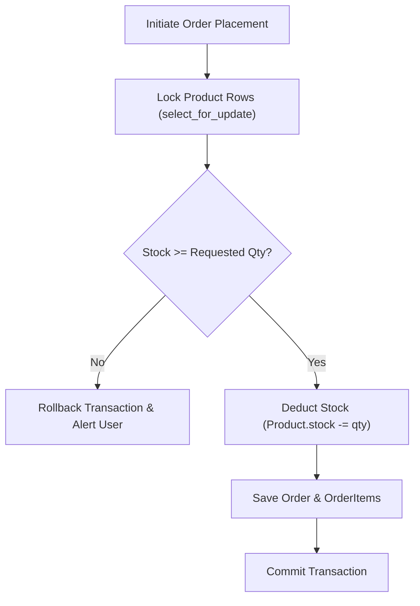
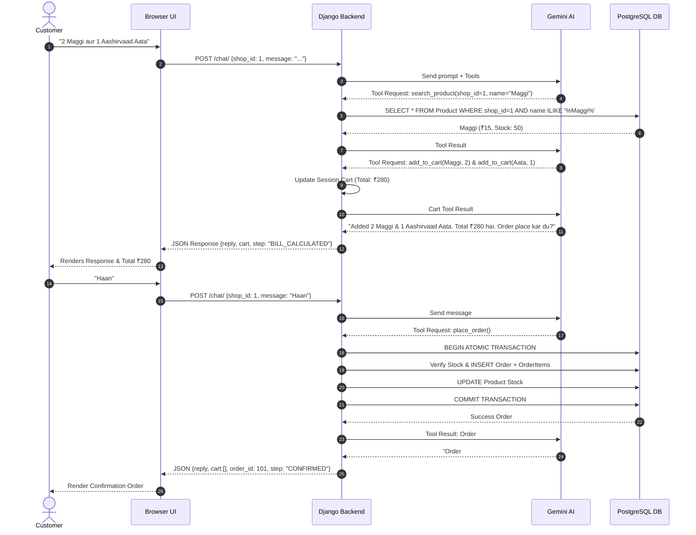

# ZERO-CLICK STORE OPERATOR — Product Requirements Document (PRD) & Technical Architecture

---

## 1. Executive Summary
**Zero-Click Store Operator** is an autonomous AI-driven commerce platform for neighborhood kirana general stores. It enables shopkeepers to easily register their shops and manage their inventory, while providing customers with a natural-language text and voice ordering experience powered by Google Gemini and Sarvam AI. 

The system isolates store inventories per shop, enforces PostgreSQL as the sole source of truth, handles multi-item Hinglish requests, requires explicit customer confirmation, and performs atomic order creation with inventory updates. A live **Autonomous Verification Loop UI** visualizes every internal step for hackathon judges and customers alike.

---

## 2. Problem Statement
Neighborhood general store owners currently face significant operational overhead:
* **Fragmented Order Channels:** Orders arrive via WhatsApp, phone calls, and walk-ins.
* **Manual Bottlenecks:** Storekeepers manually parse unstructured messages, check stock on shelves/registers, calculate bill totals, write receipts, and update stock.
* **Error-Prone Operations:** High order volumes lead to calculation errors, selling out-of-stock items, and delayed customer responses.

---

## 3. Proposed Solution
An **Autonomous AI Store Operator** serving as a digital cashier:
1. **Multi-Shop Readiness:** Shopkeepers register, set up their store profile, and list products with shop-specific prices and inventory.
2. **Customer Shop Selection:** Customers land on a store directory, pick a nearby shop, and launch an AI-assisted chat/voice session.
3. **AI Function Calling Engine:** Gemini extracts product intents and requests Django functions. Django queries PostgreSQL for real prices/stock.
4. **Shop Isolation:** All product lookups and cart items are strictly scoped to the selected shop.
5. **Atomic Fulfillment & Safety:** Gemini never invents prices or stock. Orders are committed atomically only after explicit customer confirmation.

---

## 4. Target Users
* **Neighborhood Shopkeepers (Kirana Owners):** Seeking automated order handling and inventory tracking without complex software.
* **Neighborhood Customers:** Wanting quick, natural ordering in Hindi/Hinglish/English via text or push-to-talk voice.
* **Hackathon Judges:** Evaluating real-time AI autonomous tool execution and transactional reliability.

---

## 5. User Roles
* **Shopkeeper:** Authenticated via Django `User`. Owns a `ShopkeeperProfile` and a `Shop`. Manages products, inventory stock, and views shop orders.
* **Customer:** Browses available active shops, opens a shop-specific ordering interface, builds a session cart via AI chat/voice, and confirms orders.

---

## 6. Shopkeeper Journey
```
[Shopkeeper Opens Site]
        |
        v
[Register / Login]
        |
        v
[Create Shop Profile (Name, Address, Phone)]
        |
        v
[Access Product / Inventory Management (Django Admin / Dashboard)]
        |
        v
[Add Products (e.g., Maggi ₹15 stock 50, Aashirvaad Aata ₹250 stock 20)]
        |
        v
[Activate Shop -> Available for Customer Orders]
```

---

## 7. Customer Journey
```
[Customer Opens Home Page]
        |
        v
[Select Nearby Shop (e.g., Rahul General Store)]
        |
        v
[Click 'Order' -> Enter AI Order Interface]
        |
        v
[Type / Speak Request ("2 Maggi aur aata dedo")]
        |
        v
[AI Disambiguation & Stock/Price Check via PostgreSQL]
        |
        v
[Session Cart & Bill Calculation (Total: ₹280)]
        |
        v
[Explicit Customer Confirmation ("Haan")]
        |
        v
[Atomic Order Placement & Stock Deduction -> Confirmation Displayed]
```

---

## 8. Core User Stories
* **US-01 (Shopkeeper):** As a shopkeeper, I want to list my store and products so local customers can order online.
* **US-02 (Customer):** As a customer, I want to speak or type my order naturally in Hinglish without browsing tedious catalogs.
* **US-03 (Customer):** As a customer, I want clarification if a product name is vague (e.g., "aata") so I get the exact item I want.
* **US-04 (Store Operator):** As a store operator, I want automated stock verification before order placement to avoid overselling.
* **US-05 (Judge):** As a judge, I want to visually observe the autonomous verification pipeline at runtime.

---

## 9. Functional Requirements
* **FR-01 (Multi-Shop Support):** Shopkeepers can own and configure shops; products and orders must be scoped to a single `Shop`.
* **FR-02 (Product Isolation):** Searching for products within Shop A must NEVER return products from Shop B.
* **FR-03 (NLP Parsing):** Gemini parses Hinglish requests, extracting product names and quantities.
* **FR-04 (Database Source of Truth):** Prices and stock levels must originate strictly from PostgreSQL.
* **FR-05 (Disambiguation):** System prompts user when a query matches multiple products in the shop.
* **FR-06 (Decimal Bill Calculation):** Python `Decimal` calculates subtotals and grand totals.
* **FR-07 (Session Cart):** Cart state persists in user browser sessions per shop.
* **FR-08 (Atomic Order Creation):** `transaction.atomic()` verifies stock, creates `Order` & `OrderItem` records, and updates `Product.stock`.
* **FR-09 (Verification UI):** Step-by-step UI checklist updates as backend processing executes.

---

## 10. MVP Requirements (Must Have)
1. Shopkeeper authentication (`django.contrib.auth.models.User`).
2. `ShopkeeperProfile` and `Shop` models.
3. Shop-specific `Product` management via Django Admin.
4. Home page with shop selection listing active shops.
5. Customer text AI ordering interface.
6. Gemini function calling engine integrated with Django services.
7. Disambiguation & missing quantity handling.
8. Session-based cart.
9. Bill calculation using `Decimal`.
10. Explicit customer confirmation check ("haan", "yes").
11. Atomic order placement and stock deduction (`transaction.atomic()`).
12. Autonomous verification UI pipeline display.

---

## 11. Stretch Features (Optional / Post-MVP)
* Sarvam AI Push-To-Talk Speech-to-Text (STT) and Text-to-Speech (TTS).
* Custom shopkeeper web dashboard replacing Django Admin.
* Customer address and phone registration modal.
* Low-stock warnings and product alternative recommendations.
* Direct WhatsApp Business Cloud API integration.

---

## 12. System Architecture
The application is a lightweight Django monolith coupled with PostgreSQL, communicating with Google Gemini API via server-side function calling.

```
+-----------------------------------------------------------------------+
|                            CLIENT BROWSER                             |
|   +--------------------------+    +-------------------------------+   |
|   |  Home Page (Shop Select) |    |  AI Chat & Cart Interface     |   |
|   +--------------------------+    +-------------------------------+   |
|   |                 Autonomous Verification UI Checklist          |   |
+-----------------------------------+-----------------------------------+
                                    | AJAX Fetch POST (JSON)
                                    v
+-----------------------------------+-----------------------------------+
|                        DJANGO BACKEND MONOLITH                        |
|   +---------------------------------------------------------------+   |
|   | views.py (ShopSelect, ChatView, OrderView)                    |   |
|   +-------------------------------+-------------------------------+   |
|                                   | Request Intent / Tools            |
|                                   v                                   |
|   +-------------------------------+-------------------------------+   |
|   | ai_service.py (Gemini Tool Execution Loop)                    |   |
|   +-------------------------------+-------------------------------+   |
|                                   | Tool Invocation                   |
|                                   v                                   |
|   +---------------------------------------------------------------+   |
|   | Django Business Logic (ProductService, CartService, OrderService) |
|   +-------------------------------+-------------------------------+   |
+-----------------------------------+-----------------------------------+
                                    | Django ORM (Scoped to Shop)
                                    v
+-----------------------------------+-----------------------------------+
|                        POSTGRESQL DATABASE                            |
|   (User, ShopkeeperProfile, Shop, Product, Customer, Order, Items)    |
+-----------------------------------------------------------------------+
```

---

## 13. High-Level Architecture Diagram



---

## 14. Low-Level Architecture Diagram

```mermaid
flowchart LR
    subgraph Frontend Components
        HomeHTML["index.html (Shop List)"]
        ChatHTML["chat.html (Split View)"]
        ChatJS["chat.js (Fetch & State)"]
        VerifyUI["Verification Checklist UI"]
    end

    subgraph Django Core (home app)
        AuthModule["django.contrib.auth"]
        ShopService["shop_service.py"]
        AIService["ai_service.py"]
        CartService["cart_service.py"]
        OrderService["order_service.py"]
    end

    subgraph External APIs
        GeminiAPI["Google Gemini API"]
        SarvamSTT["Sarvam STT (Optional)"]
        SarvamTTS["Sarvam TTS (Optional)"]
    end

    subgraph PostgreSQL Models
        UserModel["User"]
        ProfileModel["ShopkeeperProfile"]
        ShopModel["Shop"]
        ProductModel["Product"]
        CustomerModel["Customer"]
        OrderModel["Order"]
        ItemModel["OrderItem"]
    end

    ChatJS -->|POST /chat/| AIService
    AIService <-->|Tools Schema & Callbacks| GeminiAPI
    AIService -->|search_product| ProductModel
    AIService -->|add_to_cart| CartService
    AIService -->|place_order| OrderService
    OrderService -->|transaction.atomic| OrderModel
    OrderService --> ItemModel
    OrderService --> ProductModel
    ChatJS --> VerifyUI
```

---

## 15. Database Architecture

The database model structure established in Steps 2 & 3:

* **`User`** (`django.contrib.auth.models.User`): Standard Django user model for authentication.
* **`ShopkeeperProfile`**: Extends `User` via `OneToOneField`. Stores shopkeeper metadata (e.g. `phone`).
* **`Shop`**: Belongs to `ShopkeeperProfile`. Stores `name`, `address`, `phone`, `is_active`.
* **`Product`**: Belongs to `Shop` (`shop = ForeignKey(Shop)`). Stores `name`, `price` (Decimal), `unit`, `stock`, `is_active`.
* **`Customer`**: Stores customer details (`name`, `phone`, `address`).
* **`Order`**: Belongs to `Shop` (`shop = ForeignKey(Shop)`) and `Customer`. Stores `total_amount` (Decimal) and `status`.
* **`OrderItem`**: Belongs to `Order` and `Product`. Stores `quantity`, `unit_price` (Decimal), `subtotal` (Decimal).

---

## 16. ER Diagram



---

## 17. AI Architecture

Google Gemini API handles natural-language intent recognition and tool execution.

* **Prompt Engineering:** System prompt instructs Gemini that it is a store operator for the specified shop.
* **Tool Schema Registration:** Django passes function definitions (`search_product`, `add_to_cart`, `get_cart`, `place_order`) into every Gemini request.
* **Execution Boundary:** Gemini specifies function arguments. Django executes the function against PostgreSQL and sends the result back to Gemini to produce conversational output.

---

## 18. Gemini Function Calling

```mermaid
flowchart TD
    UserMsg["Customer: '2 Maggi aur aata dedo'"] --> Controller["Django Chat Controller"]
    Controller -->|Prompt + Tools + ShopID| Gemini["Gemini API"]
    
    Gemini -->|Tool Request: search_product| DjangoTool1["Django search_product(shop_id, 'maggi')"]
    DjangoTool1 -->|ORM Query| DB[("PostgreSQL")]
    DB -->|Maggi ₹15 Stock 50| DjangoTool1
    DjangoTool1 -->|Tool Result| Gemini

    Gemini -->|Tool Request: search_product| DjangoTool2["Django search_product(shop_id, 'aata')"]
    DjangoTool2 -->|ORM Query| DB
    DB -->|[Aashirvaad Aata, Fortune Aata]| DjangoTool2
    DjangoTool2 -->|Tool Result| Gemini

    Gemini -->|Response Output| CustomerRes["AI: 'Maggi ₹15 hai. Par Aata me Aashirvaad ya Fortune?'"]
```

---

## 19. Voice Architecture (Implemented)

```mermaid
flowchart TD
    CustomerVoice["Customer Voice Utterance"] -->|MediaRecorder Blob| JS["Browser chat.js"]
    JS -->|POST /shop/shop_id/voice-input/| VoiceView["Django Voice Endpoint"]
    VoiceView -->|audio.wav| SarvamSTT["Sarvam STT API (saarika:v1)"]
    SarvamSTT -->|Transcript| SharedEngine["Gemini AI & Django Tool Engine"]
    SharedEngine -->|PostgreSQL Queries & Cart| DB[("PostgreSQL")]
    SharedEngine -->|Text Response| SarvamTTS["Sarvam TTS API (bulbul:v3)"]
    SarvamTTS -->|Base64 Audio URI| JS
    JS -->|Audio.play()| Speaker["Customer Speaker"]

    style SarvamSTT fill:#e1f5fe,stroke:#0288d1
    style SarvamTTS fill:#e1f5fe,stroke:#0288d1
```

```

---

## 20. Conversation Flow
1. **Greeting:** AI welcomes user with shop context.
2. **Product Request Parsing:** AI identifies items and quantities.
3. **Ambiguity Resolution:** AI prompts for clarification if a name matches multiple products.
4. **Missing Quantity Check:** AI asks for quantity if unspecified.
5. **Cart Confirmation:** AI summarizes added items and asks if anything else is needed.
6. **Completion Signal:** Customer says "bas", "itna hi", or "that's all".
7. **Bill Presentation:** AI presents grand total and requests explicit confirmation.
8. **Final Confirmation:** Customer responds "haan" or "yes", triggering atomic order creation.

---

## 21. Cart Flow
* Session-based storage (`request.session['cart_<shop_id>']`).
* Stores array of `{product_id, name, unit_price, quantity, subtotal}`.
* Python `Decimal` re-calculates all subtotals and grand totals on every mutation.

---

## 22. Order Flow
1. User confirms order ("Haan").
2. System calls `place_order(shop_id)`.
3. Opens `transaction.atomic()`.
4. Validates product stock in PostgreSQL.
5. Creates `Order` with `status='confirmed'`.
6. Creates `OrderItem` records with snapshot `unit_price`.
7. Deducts `quantity` from `Product.stock`.
8. Clears session cart and returns `Order #ID`.

---

## 23. Inventory Update Flow



---

## 24. Autonomous Verification Loop

Visual progress bar in the customer ordering UI showing step execution:

```
[✓] AI Parsing  ->  [✓] Database Retrieval  ->  [✓] Inventory Check  ->  [✓] Cart Building  ->  [✓] Bill Calculation  ->  [✓] Customer Confirmation  ->  [✓] Order Creation  ->  [✓] Inventory Update  ->  [✓] Confirmation
```

---

## 25. Error Handling

| Edge Case | Handling Strategy |
|---|---|
| Product Not Found | AI informs customer product is unavailable in this store. |
| Product Ambiguous | AI lists available matching options for user selection. |
| Product Out of Stock | AI states item is out of stock. |
| Insufficient Stock | AI notifies available quantity (e.g. *"Only 2 packets left"*). |
| Customer Cancels | Cart is cleared; AI confirms cancellation. |
| DB Transaction Failure | Transaction rolls back safely; user notified of conflict. |
| Gemini API Failure | Graceful fallback error message without exposing stack traces. |

---

## 26. Security
* Credentials (`GEMINI_API_KEY`, `SARVAM_API_KEY`, `DB_PASSWORD`) strictly in `.env`.
* `.env` added to `.gitignore`.
* Gemini is sandboxed to Django tool definitions with zero direct SQL/database access.
* Database operations enforced with strict `shop_id` scoping.
* Server-side calculation of all item prices and totals using `Decimal`.

---

## 27. Non-Functional Requirements
* **Reliability:** PostgreSQL is the single source of truth.
* **Performance:** Sub-1.5s overall response time for AJAX text chat turns.
* **Usability:** Zero learning curve for non-technical retail customers.
* **Observability:** Live autonomous verification panel for demo transparency.

---

## 28. UI Requirements
* **Home Page:** Grid of shop cards with shop name, address, status, and an "Order" button.
* **Customer AI Order Page:** 
  * Left: Chat bubble interface.
  * Right: Live cart summary (items, unit prices, grand total).
  * Bottom/Sidebar: Autonomous verification checklist status.

---

## 29. Shopkeeper Requirements
* Register and log in.
* Create and update Shop details.
* Add, edit, activate/deactivate products, prices, and stock levels via Django Admin.

---

## 30. Customer Requirements
* Browse shop list.
* Select shop and launch order interface.
* Interact via natural text or push-to-talk voice.
* Receive clear bill summary and confirmation prompts.

---

## 31. API / Service Responsibilities
* `shop_service.py`: Fetch active shops, validate shop existence.
* `ai_service.py`: Wrap Gemini SDK, define tools, execute tool loops.
* `cart_service.py`: Session cart operations (add, remove, calculate total).
* `order_service.py`: Execute `transaction.atomic()` order creation & stock deduction.

---

## 32. Data Flow

```
Customer Input -> chat.js -> views.py -> ai_service.py -> Gemini API -> Django Tool -> PostgreSQL -> Django Response -> Gemini Summary -> chat.js -> UI Update
```

---

## 33. Sequence Diagram



---

## 34. 4-Hour Implementation Plan

```
+--------------------------------------------------------------------+
| PHASE 1: Core Database & Models (Done in Steps 1-3)                |
| - User, ShopkeeperProfile, Shop, Product, Customer, Order, Items.  |
+--------------------------------------------------------------------+
                                 |
                                 v
+--------------------------------------------------------------------+
| PHASE 2: Customer Home & Shop Selection (Step 4)                   |
| - Build index.html listing shops with 'Order' links.               |
+--------------------------------------------------------------------+
                                 |
                                 v
+--------------------------------------------------------------------+
| PHASE 3: Chat UI & Gemini Tool Engine (Step 5 & 6)                 |
| - Implement chat.html, chat.js, and Gemini function calling loop.   |
+--------------------------------------------------------------------+
                                 |
                                 v
+--------------------------------------------------------------------+
| PHASE 4: Atomic Order & Autonomous Verification UI (Step 7 & 8)    |
| - Implement transaction.atomic order placement & live step UI.     |
+--------------------------------------------------------------------+
                                 |
                                 v
+--------------------------------------------------------------------+
| PHASE 5: Polish & Sarvam Voice Stretch Goal (Step 9 & 10)          |
| - Add Sarvam STT/TTS push-to-talk voice and hackathon demo polish. |
+--------------------------------------------------------------------+
```

---

## 35. Demo Scenario for Hackathon Judges

1. **Shop Selection:** Show home page with multiple shops (e.g., *Rahul General Store*, *Sharma Kirana Store*). Select *Rahul General Store*.
2. **Natural Hinglish Input:** Customer types *"Bhaiya 2 Maggi aur aata dedo"*.
3. **Disambiguation:** AI responds asking *"Kaunsa aata - Aashirvaad Aata ya Fortune Aata?"*. Customer replies *"Aashirvaad"*.
4. **Verification Checklist UI:** Show steps live-checking in real time (`AI Parsing` → `Database Retrieval` → `Inventory Check` → `Cart Building` → `Bill Calculation`).
5. **Bill & Order Confirmation:** Right panel shows grand total ₹280. Customer types *"Haan"*.
6. **Atomic Transaction Verification:** Show `Order Creation` and `Inventory Update` checkmarks. Verify stock deduction in Django Admin.

---

## 36. Future Enhancements
* WhatsApp Cloud API Webhook Integration for direct WhatsApp ordering.
* Voice streaming over WebSockets for real-time natural dialogue.
* Proactive store stock reorder alerts for kirana shopkeepers.
* Personalization & customer order history lookup.

---

## 37. Implemented MVP Summary
* **Backend:** Python 3.14 + Django Monolith + Django ORM
* **Database:** PostgreSQL (Source of Truth)
* **Frontend:** Django Templates + HTML5 + CSS + Vanilla JavaScript
* **AI Layer:** Google Gemini API (`google-genai` / `google-generativeai`) + Server-side Tool Execution + Fallback Engine
* **Voice Layer:** Sarvam AI STT (`saaras:v3`) + Sarvam AI TTS (`bulbul:v3`) Push-To-Talk
* **Supported Languages:** English, Hindi, Hinglish (code-mixed)
* **Cart & Order Safety:** Django Session Cart + Python `Decimal` Calculation + `transaction.atomic()` Order Placement & Row-level Inventory Deduction

